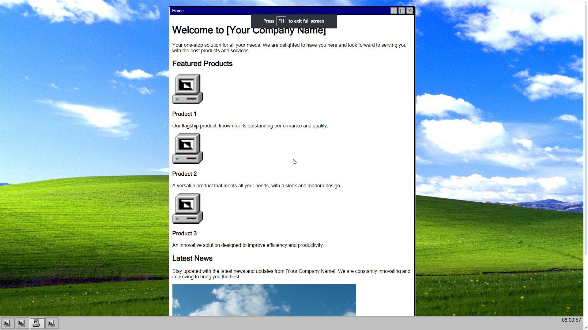

# 🖥️ Windows 98 Theme Web Application

Welcome to the Windows 98 Theme Web Application! This project aims to replicate the nostalgic look and feel of the classic Windows 98 operating system on a web interface.

## Description

This web application uses HTML, CSS, and JavaScript to create a user interface reminiscent of Windows 98. It includes styled components such as the taskbar, windows, buttons, and icons to mimic the aesthetic of the old operating system.

## File Structure

```
├── package.json
├── package-lock.json
├── public
│   ├── 404.html
│   ├── about.html
│   ├── assets
│   │   ├── css
│   │   │   ├── navbar.css
│   │   │   ├── styles.css
│   │   │   └── vars.css
│   │   └── images
│   │       ├── icons
│   │       │   └── accessibility_contrast.png
│   │       ├── sky-and-windows-98-logo.jpg
│   │       ├── windows-98-hills.jpg
│   │       ├── windows98-logo-name.png
│   │       └── windows98_logo.png
│   ├── index.html
│   ├── js
│   │   ├── clock.js
│   │   ├── index.js
│   │   └── selection-box.js
│   └── partials
│       ├── footer.html
│       └── navbar.html
├── replit.nix
└── src
```

## Features

- **Windows 98 Theme**: Styled components to resemble Windows 98 UI elements.
- **Background Image**: Static background image with a Windows 98 logo.
- **Navbar and Footer**: Customized to match the Windows 98 taskbar and footer styles.
- **Responsive Design**: Ensures compatibility across different screen sizes.

## Installation

To run the application locally, follow these steps:

1. Clone the repository: `git clone https://github.com/devvyyxyz/windows-98-website.git`
2. Navigate to the project directory: `cd windows-98-website`
3. Open `index.html` in your web browser.

## Usage

- Access the home page: `/index.html`
- Navigate to the about page: `/about.html`

## Credits

- Icons sourced from [Windows 98 Icons by Alex Meub](https://win98icons.alexmeub.com/).
- Background images and logos are property of Microsoft Corporation.

## License

This project is licensed under the MIT License. See the [LICENSE](./LICENSE) file for details.
